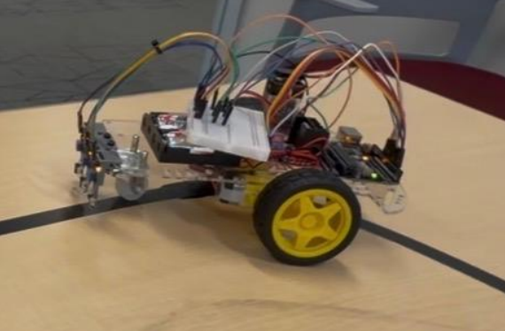
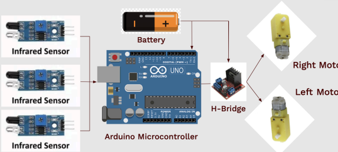

# PD Line Following Robot
Arduino-based line-following robot using PD control for smooth and stable real-time path tracking.

## Overview
This project is a differential-drive line following robot built using an Arduino Uno, a three-sensor infrared (IR) array, and a motor driver. The robot detects its position relative to a line and uses a proportional-derivative (PD) controller to adjust motor speeds in real time, resulting in smooth and stable path tracking.

Unlike basic on/off line-following logic, this system continuously corrects its position using feedback control, improving response time and reducing oscillations.

## Features
- Real-time line detection using a 3-IR sensor array
- Error-based steering correction
- PD control for smooth and stable tracking
- Differential drive using two DC motors
- Ability to follow both straight and curved paths

## Hardware
- Arduino Uno R3  
- 3x IR sensors  
- H-bridge motor driver  
- 2x DC motors with encoders  
- Battery power supply  
- 4WD Smart Robot Car Chassis Kit (EMOZNY) including motors, wheel encoders, and mounting platform  

## Control System
The robot calculates an error based on sensor readings, indicating whether it is centered, drifting left, or drifting right of the line.

A PD controller is applied:
- **Proportional (P):** Corrects based on current error  
- **Derivative (D):** Reduces overshoot by reacting to the rate of change  

The controller output adjusts PWM signals sent to each motor, allowing the robot to steer smoothly back toward the line.

## Modeling & Analysis
A transfer function of the system was derived to model the robot’s dynamic response and support controller design. This allowed for more systematic tuning of the PD controller and improved understanding of system behavior compared to trial-and-error tuning alone.

## Results
- Tuned controller gains:
  - Kp = 11.977
  - Kd = 1.783
- Response time: approximately 120–160 ms
- Stable tracking with minimal oscillation
- Successfully followed both straight and curved paths

## CAD & Mechanical Design
A custom mount for the IR sensor array was designed in CAD to ensure proper alignment, spacing, and consistent distance from the ground surface. This improved sensor reliability and overall tracking performance.

## My Contributions
- Implemented Arduino control logic for line tracking
- Derived system transfer function for modeling and analysis
- Designed and tuned the PD controller for improved stability
- Designed a CAD mount for IR sensors and integrated hardware
- Performed testing and iterative tuning for performance optimization

## Project Structure
- `/code` -> Arduino source code (.ino)
- `/docs` -> Final project report
- `/cad` -> CAD model for custom IR sensor mount
- `/media` -> Images and demo videos

## Robot

Final assembled robot used for testing and validation.

## Functional Block Diagram of System

Control system showing sensor input, PD controller, and motor output.

## Documentation
[View Project Report](docs/pd-line-following-report.pdf)  
[View Presentation](docs/final-presentation.pdf)

Includes system modeling, transfer function derivation, PD controller design, and experimental results.

## Demo Video
[Watch Demo](https://youtu.be/5HAEdm1L99w)

## What I Learned
- Practical implementation of feedback control systems
- PD controller tuning and real-world performance tradeoffs
- Transfer function modeling and system analysis
- Sensor integration and signal interpretation
- Real-time embedded system design using Arduino
