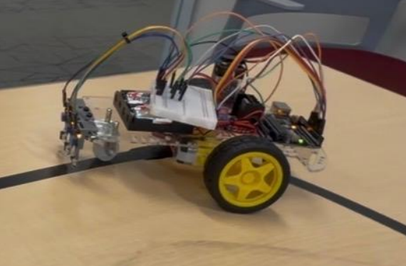

# PD Line Following Robot

Arduino-based differential-drive robot using a 3-sensor IR array and **PD feedback control** for smooth real-time path tracking.

## Demo
[Watch Demo Video](https://youtu.be/5HAEdm1L99w)



## Project Summary
This robot detects its position relative to a path using three infrared sensors and continuously adjusts motor speed with a proportional-derivative controller. Compared with basic on/off line following, the PD controller reduces oscillation and improves tracking stability.

## Key Features
- Real-time line detection using a 3-IR sensor array
- Error-based steering correction
- PD control for smoother response and reduced overshoot
- Differential-drive motor control with PWM speed commands
- CAD-designed IR sensor mount for improved alignment and repeatability

## Hardware
| Component | Purpose |
|---|---|
| Arduino Uno R3 | Main controller |
| 3x IR sensors | Line detection |
| H-bridge motor driver | Motor direction and speed control |
| DC motors with encoders | Differential-drive motion |
| 4WD smart robot chassis | Mechanical platform |
| Custom CAD mount | IR sensor positioning |

## Control Approach
The controller calculates an error based on sensor readings:

- Left sensor active → robot is left of center / correction needed
- Right sensor active → robot is right of center / correction needed
- Centered reading → continue forward

The PD controller applies:

```text
control = Kp * error + Kd * (error - previous_error)
```

The output adjusts left and right motor PWM values to steer the robot back toward the line.

## Results
- Tuned controller gains: `Kp = 11.977`, `Kd = 1.783`
- Approximate response time: `120–160 ms`
- Stable path tracking with reduced oscillation
- Successful tracking on straight and curved paths

## My Contributions
- Implemented Arduino control logic for line tracking.
- Derived system transfer function for modeling and controller design.
- Tuned PD gains through testing and iteration.
- Designed CAD mount for IR sensor alignment.
- Integrated sensors, motor driver, chassis, and control logic.

## Repository Structure
```text
code/    Arduino source code
docs/    project report and final presentation
media/   robot photos and diagrams
```

## Documentation
- [Project Report](docs/pd-line-following-report.pdf)
- [Final Presentation](docs/final-presentation.pdf)

## What I Learned
- Practical feedback control implementation
- PD tuning tradeoffs in physical systems
- Sensor alignment and signal interpretation
- Real-time embedded motor control
- Translating control theory into hardware behavior
